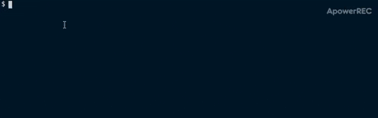

<p align="center">
<a href="https://github.com/brunohafonso95/mongo-compare" target="blank"></a>
</p>


[](https://codecov.io/gh/brunohafonso95/mongo-compare)
[](http://commitizen.github.io/cz-cli/)


# Description

Mongo-compare is a CLI to make comparisons between documents in different collections and mongoDB databases.

# Getting start

## Installation

to install the cli you just need to execute the following command

```bash
# with npm
npm install -g mongo-compare

# or with yarn
yarn global add mongo-compare
```
## Using the cli

1. first you need to generate the base configuration of the cli, so to create the base config you execute the following command

```bash
mongo-compare -i
# or
mongo-compare --init
```

this command will ask for some parameters as the gif bellow



option                              | description
----------------------------------- | --------------------------------------------
output format                       | format that the results will be generated
mongo-compare config file           | name and path of the config file (default: mongo-compare-config.json)
folder path to output the results   | the path where the result will be generated (default: mongo-compare-results)
override mongo-compare config file  | if the config file already was generated before, you could override it
mongo-compare config file extension | extension of the config file (default: json)
remove folder with actual results and create it again | if the folder already was generated before, you could override it

In the final the folder where the results will be exported will be created and a file with the config will be generated with a content as the example bellow:

```javascript
{
  "outputFormat": "json", // format that the compare results will be generated
  "outputResultFolderPath": "mongo-compare-results", // the folder where the results will be exported
  "collectionsConfig": [] // the list of collections that will be compared
}
```

2. now you just need to populate the configuration on file just like the following example:

```javascript
{
    "outputFormat": "json",
    "outputResultFolderPath": "mongo-compare-results",
    "collectionsConfig": [
        {
            "currentCollection": {
                "url": "mongodb://127.0.0.1:62391/jest?", // url of running mongoDb
                "dbName": "jest", // database name
                "collectionName": "test1", // collection name
                "filterBy": "name", // the name of field that make the document unique on collection, could be and array
                "ignoreFields": ["_id"] // fields that will be ignored on compare [optional]
            },
            "previousCollection": {
                "url": "mongodb://127.0.0.1:62391/jest?",
                "dbName": "jest",
                "collectionName": "test2",
                "filterBy": "name"
            }
        },
    ]
}
```

field                              | description
----------------------------------- | --------------------------------------------
outputFormat                        | format that the results will be generated
outputResultFolderPath              | folder path where the results will be generated
collectionsConfig                   | list of collections that will be compared, that options of config is bellow
url                                 | url of running mongoDb
dbName                              | database name
collectionName                      | collection name
filterBy                            | the name of field that make the document unique on collection, could be and array if you need to filter by two or more fields to make a document unique on collection
ignoreFields                        | fields that will be ignored on compare (default ["_id"])

3. the next step is run the command to execute the compare and generate the results

```bash
# if you dont pass the path of config file it will use the default: mongo-compare-config.json
mongo-compare
# to pass the path of config file
mongo-compare -c <path of the config file>
# or
mongo-compare --config <path of the config file>
```

the results will be generated on the folder specified on config file, you can see the progress step by step on the logs, and the result will be something just like this:


```javascript
[
    {
        "collectionName": "test1",
        "differences": {
            "diffKeys": ["prop1"],
            "currentDocument": { "dbName": "jest", "prop1": 1, "name": "test" },
            "previousDocument": { "dbName": "jest", "prop1": 2, "name": "test" }
        }
    },
    {
        "collectionName": "test3",
        "differences": {
            "diffKeys": ["prop1"],
            "currentDocument": { "dbName": "jest", "prop1": 1, "name": "test" },
            "previousDocument": { "dbName": "jest", "prop1": 2, "name": "test" }
        }
    },
    {
        "collectionName": "test3",
        "differences": {
            "diffKeys": [],
            "currentDocument": { "dbName": "jest", result: 'not exists', },
            "previousDocument": { "dbName": "jest", "prop1": 2, "name": "test" }
        }
    }
]
```

field                              | description
---------------------------------- | --------------------------------------------
collectionName                     | name of the collection
differences                        | field with the difference details
diffKeys                           | the fields that have the differences
currentDocument                    | the actual document
previousDocument                   | the previous document
dbName                             | the name of the database
rest of the fields of document     | rest of fields of the document that has the difference
result                             | if the document exists on just a collection this field will be returned with the value 'not exists'

## Using the package programmatically

you can also use the package programmatically, just install the package and import it to use the methods available, to see how to use the methods just execute the bellow  and the documentation will be generated with jsdoc.

```bash
# with npm
npm run docs
# with yarn
yarn docs
```

## executing the Tests

to execute the test run the following command:

```bash
# with npm
npm test
# with yarn
yarn test
```
